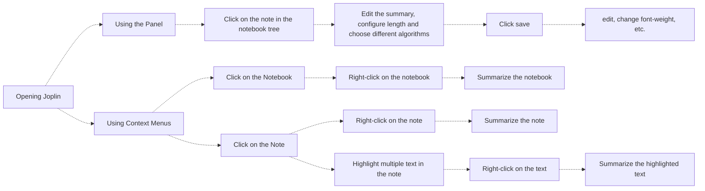

# 🤖 Summarize your notes with Joplin AI!

## 1. Introduction

### 1.1 Motivation

The project aims to create note summaries to help users synthesize main ideas and arguments to identify salient points. This means that users will have a clear idea of what the note is about in a short piece of text with less mental effort.

#### Example Use Cases:

- Assist in processing notes to improve efficiency: Distill critical information from
  notes, highlight key ideas and quickly skim notes.
- Classify or cluster notes by their contents: Summarize key concepts from notes
  and use them in similar group notes. This could be used for tagging notes.
- Distill important information from long notes to empower solutions such as
  search, question, and answer.

### 1.2 Types of Summaries

There are two main types of summarization: extractive and abstractive

● **Extractive summarization**: This method takes sentences directly from the original
note, depending on their importance. The summary obtained contains exact
sentences from the original text.

● **Abstractive summarization**: Abstractive summarization is closer to what a human
usually does — i.e., conceive the text, compare it with their memory and related
information, and then re-create its core in a brief text.

Abstractive summarization tends to be more computationally expensive since you must utilize neural networks and generative systems. On the other hand, extractive summarization does not require the use of deep learning and data labeling [1].

## 2. Usage

### 2.1 Hide/Show Panel

Starting the Joplin will at first make the Joplin AI Summarization panel appear. Users can hide/show panel by using keyboard shortcuts: `command + shift + f` (MacOS)
and `ctrl + shift + f` (Windows).

### 2.2 Flowchart

#### Panel

Clicking on the notes in the panel will also open notes in Joplin. There, you can craft your own summary by adjusting its length and generating multiple versions of summaries by performing various algorithms (LexRank, TextRank, LSA, KMeans Clustering) to find the best summary.

#### Joplin App

In Joplin, you can summarise notes by using:

1. Note Context Menu
2. Notebook Context Menu
3. Editor Context Menu

##### Testing

Run unit tests by running `npm run test`. The testing framework that we are using is `jest`.

### 2.3 📹 Video Demonstration

#### 2.3.1 Panel

https://github.com/user-attachments/assets/4f2d1786-b7f2-4cfc-8210-f166dc7888b6

---

#### 2.3.2 Context Menus

https://github.com/user-attachments/assets/4506769c-d2ad-4e97-a1aa-e193aab9ca4d

# About the plugin

#### a. By Ton Hoang Nguyen (Bill) 🧑‍💻: https://github.com/HahaBill

#### b. Google Summer of Code 2024: https://summerofcode.withgoogle.com/programs/2024/projects/Ble8LKDb

#### c. Project Website: https://discourse.joplinapp.org/c/gsoc-projects/summarize-ai/35

# References

[1] IBM - Text Summarization https://www.ibm.com/topics/text-summarization

[2] Automatic Text Summarization Methods: https://arxiv.org/abs/2204.01849
